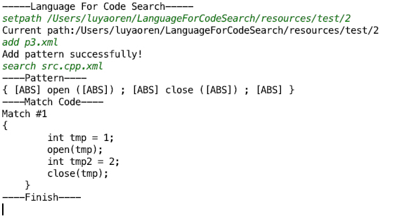

# Language For Code Search


<h3 align = "center">《编程语言的设计原理》课程大作业</h3>
<h5 align = "center">任路遥 1500012787</h5>	
<h5 align = "center">王文涛 1600012719</h5>


​																				

​																				


## 设计目标

本语言是一种基于程序语法定义搜索模板来进行代码搜索的领域特定语言。其设计目标是增强对代码搜索的表达能力。

现在一般的编辑器或搜索引擎中代码搜索功能还比较简单，一般只支持如基于关键词或者字符串级别的正则表达式匹配。虽然基于正则表达式匹配的搜索提供了一定的搜索能力，但却有一些显著的缺点：

1. 没有考虑对应程序语言的语法。搜索时如果用户不加以约束会得到许多语法上无关的片段。比如用户想要找到所有函数`a`出现的地方，然而单纯的字符串匹配会同时找出所有包含`a`这个字符的地方。用户为了剔除这些无关的结果必须使用更多的技巧来加以限制（如加上`\b`）。
2. 难以处理超出正则语言表达能力的要求。比如用户要求查找`open($var); ... close($var);`的片段，其中两处`$var`要求相同。这就超出了正则语言的表达能力。
3. 缺乏对不同层次的抽象。如考虑表达式`a > 0`，其对应有不同程度的抽象，如I. 包含运算符 >，形如`#expr1 > #expr2` II. 包含变量`a`和运算符`>`，形如  `a > #expr` III. 包含变量`a`和运算符`>`，且等号右边为数字, `a > #num` 等等。

这些缺点在实际生产过程中比较普遍。

为此，我们设计了基于语法的代码搜索匹配工具。用户需要使用我们设计的一种特定的语言来表达需要匹配的模式。我们的工具提供：

1. 灵活性：支持不同层次的抽象；加入了许多灵活的特性，如fold, bind等，来满足用户常见的需求
2. 易用性：支持从已用代码片段的基础上定义模式，便于用户使用；支持迭代式的请求，从之前筛选下来的结果中进一步筛选
3. 对多种语言的可扩展性：支持多种语言

## 设计思想

由于我们所有匹配都基于语法，所以所有代码和模式都必须先转化为AST(抽象语法树)表示。我们提供了`srcML`工具，该工具可以将源代码和用户请求的模式代码都转化成XML形式的AST。用户请求的模式代码的语言是一般代码的语言的扩展：里面可以有一些抽象的符号和用户自定义的变量等，来表达用户的需求。最后用模式代码的AST去匹配源代码的AST，得到所有匹配结果。

`srcML`支持将多种语言(Java/C/C++/C#)转化为统一的代码表示。之后的操作与具体语言无关。所以就自然提供了对多种语言的可扩展性。

迭代式的请求也很好实现，只需要保存之前的结果列表，每次用新的模式去筛选一遍之前的结果就行了。

我们的重点在支持不同层次的抽象，以及如何设计算法匹配这些抽象的模式。这些抽象与具体的匹配方法紧密相关。

我们采用自顶向下，即递归的匹配方法。具体来说，就是实现一个递归函数`match(source, pattern)`，返回两棵AST源代码`source`和模式`pattern`是否匹配。

对于`pattern`中没有任何抽象、要求完全匹配的情况，显然问题可以拆解为这两棵树的根的属性完全匹配，并且它们的所有儿子的子树也都完全匹配。这就是一个递归的问题。

为了支持在模式中匹配任意多的元素（可以是空），我们引入了`<abs>`标记。这种标记可以和任意AST匹配（可以是空）。比如要支持`open(); ... close();`这种模式，中间的`...`即可用`<abs></abs>`匹配。

我们还支持OR运算，即可以在匹配多种模式中的任意一种。OR运算具体在下面的标记内实现。

我们还支持`<fold>`标记。这种标记内包含一些模式，这些模式用OR运算结合起来。`<fold>`放松了其儿子的子树必须直接和相应源代码中的儿子的子树匹配的要求，只要源代码的任意一个子树可以匹配，就算能匹配。比如我们想要`{Anything}.f()`(包括`f()`, `a.f()`, `a.b.f()`, `a.b.c.f()`等格式)，我们可以写成`<call><fold><name>f</name></fold><argument_list>()</argument_list></call>`，也就是将`f`用`<fold>`包装起来，这样就可以匹配任意包含`f`的表达式。

我们还支持用户定义变量。对于一些重复出现的子模式或者较为复杂的模式，用户可以定义一些代表模式的变量。具体使用`<v-?>`的形式在相应的变量模块里定义，其中`?`是变量名。这样在另一个模式中就可以直接用变量来代表相应的模式。变量中可以套多个pattern，用OR运算结合起来。

我们还支持变量绑定，在变量定义时在attribute中加入`bind="true"`标记。对于绑定的变量，其所有匹配的地方的内容必须完全一致。比如用户需要匹配`open($var); ... close($var);`的模式，其中`$var`两次出现的地方的内容必须完全相同。用户只需定义一个绑定的变量`var`，然后在主要的模式里使用这个变量即可。如果`var`没有绑定，则可能会匹配到像`open(tmp); ... close(tmp2);`这样的形式，这不是用户所期望的。在具体实现时，对于绑定的变量，我们记录其第一次匹配到的AST，之后再遇到这个变量就要求和之前的记录完全相同。

## 形式定义

Syntax:

```
code ::= text
       | code1 code2
       | <AnyElement> code' </AnyElement>
       | <abs> </abs>
       | <fold> code' </fold>
       | <v-$varName> </v-$varName>

variableDefinitions ::= <var> {variableDefinition} </var>
variableDefinition ::= <v-$varName [bind="true"]> (code | {<udv> code </udv>}) </v-$varName>
```


Evaluation: (`mu` for variable binding history)

```
source_text == pattern_text | mu
--------------------------------
match(source_text, pattern_text) | mu


match(source_code1, pattern_code1)  match(source_code2, pattern_code2) | mu
---------------------------------------------------------------------------
match(source_code1 source_code2, pattern_code1 pattern_code2) | mu


match(source_code, pattern_code) | mu
----------------------------------------------------------------------------------------
match(<SomeElement> source_code </SomeElement>, <SomeElement> pattern_code </SomeElement>) | mu


-------------------------------------
match(source_code, <abs> </abs>) | mu


match(source_code, pattern_code) | mu
----------------------------------------------------
match(source_code, <fold> pattern_code </fold>) | mu


match(sub_source_code, <fold> pattern_code </fold>), sub_source_code in source_code | mu
----------------------------------------------------------------------------------------
match(source_code, <fold> pattern_code </fold>) | mu


match(source_code, definition_code)  <v-$varName> definition_code </v-$varname> in variableDefinitions | mu
------------------------------------------------------------------------------------------
match(source_code, <v-$varName> </v-$varName>) | mu


match(source_code, definition_code)  <v-$varName bind="true"> definition_code </v-$varname> in variableDefinitions  $varName unbind in mu | mu
------------------------------------------------------------------------------------------
match(source_code, <v-$varName> </v-$varName>) | (mu, $varName -> source_code)


<v-$varName bind="true"> definition_code </v-$varname> in variableDefinitions  $varName -> binding_code in mu | mu
------------------------------------------------------------------------------------------
match(binding_code, <v-$varName> </v-$varName>) | mu
```

## 代码使用方法

代码和相关文件已上传至GitHub：https://github.com/FancyCoder0/LanguageForCodeSearch

`src`文件夹是主要的代码，用Java实现。`resources/test`是一些测试用例。

编译运行代码：整个工程使用maven来管理。请使用maven来导入和编译。主入口在[src/main/java/l4cs/Main.java](src/main/java/l4cs/Main.java)中。

环境：Java JDK1.8

编译：主目录下使用命令 `mvn package`

运行：直接运行或调用maven生成的jar包。

使用方法：

程序会记录一个当前路径和一个模式列表。初始时都为空。

运行之后会进入一个交互循环。你可以输入一行命令。有如下几种命令：

* `reset`: 恢复初始状态。
* `clear`: 清空模式列表。
* `setpath $PATH`: 将当前路径设为`$PATH`。
* `add $PATTERN_PATH`: 添加一个模式到模式列表。模式必须以XML文件的形式给出。程序会尝试相对于当前路径或者绝对路径来查找`$PATTERN_PATH`并读入。
* `search $SOURCE_PATH`: 在给定的源代码中搜索满足模式队列中所有模式的结果。这里，`$SOURCE_PATH`代表带搜索的文件，需要在相对与当前路径或者绝对路径下。这里的文件可以是源代码格式(.c,.cpp,.java后缀)，也可以是已经转换成XML的格式(.xml后缀)。但注意，由于项目依赖于srcML生成代码对应的XML，如果需要新增源代码进行搜索，则需要先使用srcML转成XML或使用提供的脚本[resources/test/getxml.py](resources/test/getxml.py)适配，但直接使用XML格式的文件则没有该问题。

举例（绿色为输入的指令）：




## 课程感想

任路遥：这门课让学习到了如何严谨地设计一门语言以及使用类型系统进行推导。这门课既有形式化的定义和推导，也包含了实践编程的内容，将理论与实践结合，让我感受到了编程语言的美妙。这门课也让我对计算机科学，尤其是程序语言领域有了进一步的了解和认识。关于课程本身，我觉得内容安排、考核方式都很合理，但在作业反馈这一块希望助教或者老师能够有更多的反馈。

王文涛：有人问我，有什么课的内容是只能在北大而不能在其他地方学到的。我不假思索地回答这门课。感谢熊老师、胡老师和赵老师的精彩演绎。事实上我一直以来对这个领域很有兴趣，上这门课是我每星期的一大享受。这套理论就如古希腊艺术一样纯净优雅。而各位老师和历史上各位语言的设计者就是艺术家。只可惜这门精美的艺术看起来很少有世人能欣赏。也许就像很多艺术作品一样，在问世时不被重视，要直到多年以后才会被重新认识。但很遗憾我没有勇气做一位这样的艺术家。我似乎更愿意做一个威尼斯商人，用主业资助艺术的创作。关于课程本身，我赞同任路遥的看法，作业反馈是稍有欠缺。

